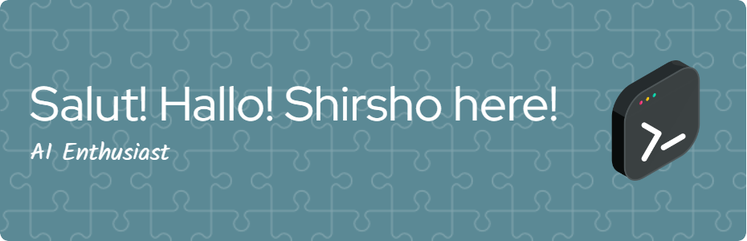

Hello to whoever's looking at my GitHub. I'm Shirshajit (I commonly go by Shir-sho), a CS+Math+German student at NUS. My interests are in Computer Vision, Reinforcement Learning, Human-Computer Interactions, FinTech, and Full-Stack Development. I enjoy making things that encourage laziness.

## 📫 How to reach me:  

## 🔧 Technologies & Tools

#### I am currently learning 🌱 Relational Deep Learning, AutoML, and 

#### I am currently working on 🔭:

## &#x1f4c8; GitHub Stats

##### Pronouns: He/Him

### fun story ⚡
In 2nd grade I broke my arm by falling off a slide right before the chess championship final. I was so scared of getting forfeited I ended up playing the game without telling anyone. Somehow I won! But because I wasn't celebrating, the teacher grabbed both my hands and lifted me up. Now that was a memory!

<!--

**shirsho-12/shirsho-12** is a ✨ _special_ ✨ repository because its `README.md` (this file) appears on your GitHub profile.

Here are some ideas to get you started:

- 🔭 I’m currently working on Smart Glasses AI with the NUS Human-Computer Interaction Lab
- 🌱 I’m currently learning Flutter, FaunaDB, Human Computer Interactions, and FinTech AI
- 👯 I’m looking to collaborate on any and all hackathons
- 🤔 I’m looking for help with the intricacies of Flutter
- 💬 Ask me about Chess, Coding, Table Tennis, or just anything you feel like

- 😄 Pronouns: He/Him
- ⚡ Fun fact: ...
-->
